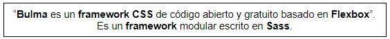
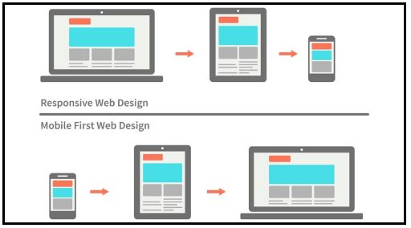
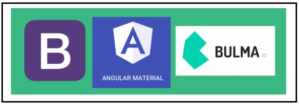
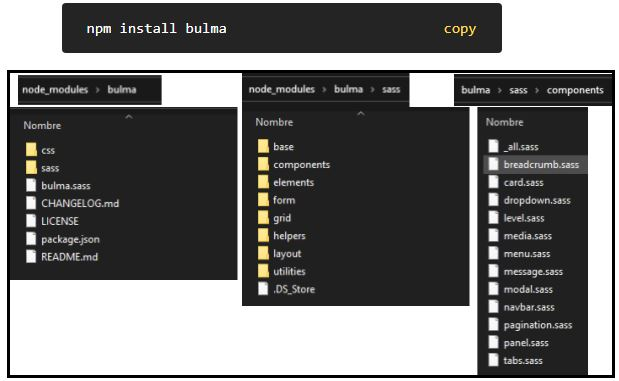
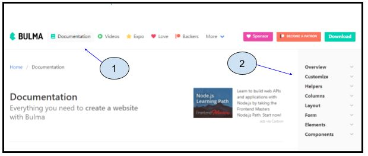
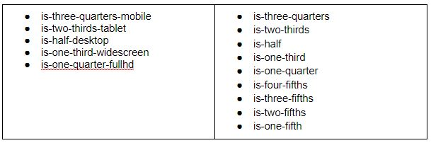
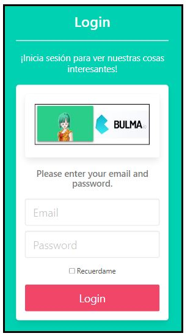

# Introducción a Bulma CSS

## ¿Qué es Bulma Css?

- [Página oficial de Bulma](https://bulma.io/)
- [Página oficial de Sass](https://sass-lang.com/)

## ¿Qué lo hace especial?
1) **No tiene Js.**
2) Es un framework mobile first.

- [Responsive en Bulma](https://bulma.io/documentation/overview/responsiveness/)

## ¿Cuál elegir y para qué casos?

- [Página oficial de Bootstrap](https://getbootstrap.com/)
- [Página oficial de Angular Material](https://material.angular.io/)

## ¿Cómo se instala?

## ¿Cómo se empieza?

## ¿Qué clases tengo que tener en cuenta?
Estas son las opciones que podemos usar para controlar el ancho de columna:

## Ej: Login

Ejemplo de maquetado para una landing Pages.

https://javifont.medium.com/aprende-bulma-en-5-minutos-3c919baaf41b

http://developinginspanish.com/2018/04/09/aprende-bulma-en-5-minutos/

https://webdesign.tutsplus.com/es/tutorials/quick-tip-how-to-build-a-blog-layout-with-bulma--cms-28091

https://parzibyte.me/blog/2020/12/26/plantilla-inicial-bulma/

http://evilnapsis.com/2019/10/15/crear-paginas-web-con-bulma-css-framework/

https://maquetando.com/bulma-css-un-framework-ligero--poderoso-y-actual/

